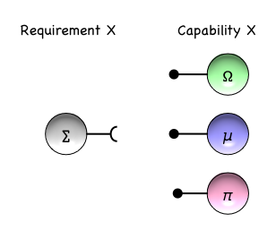
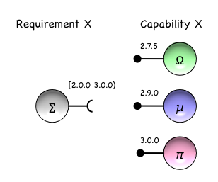
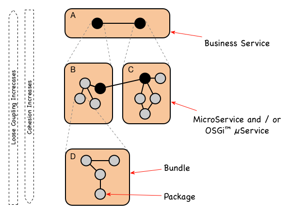
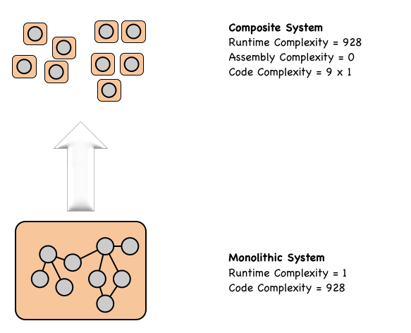
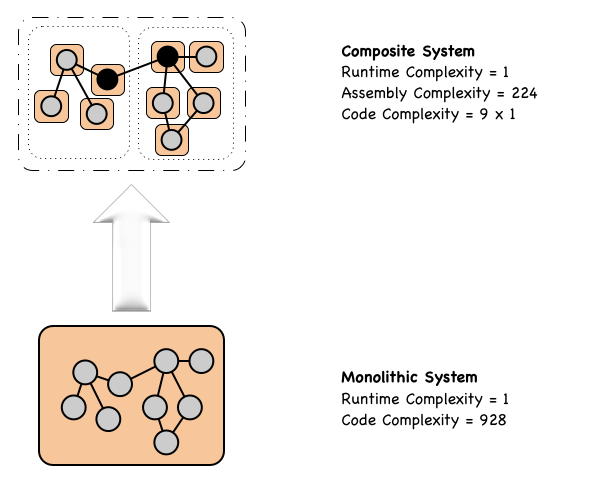

## The Problem

Low-maintenance, Agility and Adaptability are essential charactersitics required by tomorrow's software eco-systems (e.g. Smart City and Industry4.0). Yet, as DARPA realise, today’s software systems fail to meet these objectives.

> Modern-day software systems, even those that presumably function correctly, have a useful and effective shelf life orders of magnitude less than other engineering artefacts ...

> while an application's lifetime typically cannot be predicted with any degree of accuracy, it is likely to be strongly inversely correlated with the rate and magnitude of change of the ecosystem in which it executes.

[`Building Resource Adaptive Software Systems` - The DARPA BRASS Initiative 2015](https://www.darpa.mil/program/building-resource-adaptive-software-systems).

Realizing this, DARPA issued the challenge to create software systems that avoid obsolescence; to create software eco-systems that are able to run for more than 100 years. Such software eco-systems must be economically sustainable over these extended periods, and to achieve this longevity, they must be cost-effective to adapt and evolve in response to unforeseen changes in environmental conditions, be simple to maintain, or more probably, be self-maintaining.

While this DARPA initiative is recent, software scientists have been aware of these foundational issues since the early 1970's.

Noteable insights into the nature of this problem include:

*Gall's Law (1975)*
> A complex system that works is invariably found to have evolved from a simple system that worked. A complex system designed from scratch never works and cannot be patched up to make it work. You have to start over, beginning with a working simple system.

and

*Lehman’s Law (1974)*
> As a system evolves, its complexity increases unless work is done to maintain or reduce it.

Yet, a decade into 'virtualisation' and more recently Containerisation and these maintainability and evolvability goals seem more illusive than ever.

Why is this so?

While `Structural Complexity` and `Change` are challenges shared by all engineering disciplines; it is perhaps the fluidity and rate of change that uniquely differentiates software engineering; perhaps aligning it closer to Biological or Social Systems. And so, it is perhaps to those disciplines we should look to for guidance?

## Complexity, Change and the role of Modularity

Biological, Ecological and Social systems are neither Chaotic, or completely Deterministic in behavior; rather they are **Agile** and able to **Adapt** to the environments within which they they find themselves embedded. These Systems achieve this while maintaining internal organisational patterns and such system are collectively referred to as Complex Adaptive Systems (CAS). 

All Complex Adaptive Systems (CAS) are composed of a hierarchy of structural layers; each layer internally modular; thereby building an intricate hierarchy of boundaries and signals: [Signals and Boundaries - John Holland](https://mitpress.mit.edu/books/signals-and-boundaries).

### Modularity  

Why is Modularity so important? Modularity makes complexity manageable; Modularity enables parallel work; and Modularity is tolerant of uncertainty. By “tolerant of uncertainty” we mean that particular elements of a modular design may be changed after the fact and in unforeseen ways: see [Design Rules, Volume 1 The Power of Modularity](https://mitpress.mit.edu/books/design-rules). 

To successfully implement Modularity, the internal implementation details of a Module must be shielded from the Module's external environment: the external environment being the aggregate of all other modules, the underlying runtime and higher level Services. The only permissible interactions between the Module, and its host `Environment`, is then via the Module’s (in a software context) public Interfaces. 

Once achieved, the internal mechanisms within a Module are decoupled from the external environment.

Regarding the importance of Modularity in Software, [Parnas](https://en.wikipedia.org/wiki/David_Parnas) in his seminal paper [On the Criteria To Be Used in Decomposing Systems into Modules](http://repository.cmu.edu/cgi/viewcontent.cgi?article=2979&context=compsci), [Parnas](https://en.wikipedia.org/wiki/David_Parnas) states...

> “The major advancement in the area of modular programming has been the development of coding techniques and assemblers which (1) allow one module to be written with little knowledge of the code in another module, and (2) allow modules to be reassembled and replaced without reassembly of the whole system. This facility is extremely valuable for the production of large pieces of code ..."

Parnas goes on to explain that...

> the impact of change on a Modular composite system is dictated by _how_ the system was decomposed. If a small change in a single Module causes a cascade of many downstream changes in other modules; then Modules in the system are **tightly-coupled**. However if the change results in with minimal / no / downstream changes, then the Modules in the System are **loosely-coupled**.

### Cohesion & Loose Coupling 

To accomodate structural change Systems must attempt to localise and / or minimise the effects of Change. 

To achieve this, components within the System that are closely related, that must change in unison, that must evolve together, need to be colocated together ideally within the same logical unit; i.e. a Module. Meanwhile, Components that evolve at a different rates, and/or could be used separately in different runtime contexts, should be in separate Modules, and these Modules should be `Loosely Coupled` via the published Interfaces that change much more slowly over time.
 
In software engineering these principles are referred to as the `Principles of Package Cohesion` which state that: 
   * Reuse-release equivalence principle (REP) - The unit of reuse is the unit of release.
   * Common-reuse principle (CRP) - Classes that aren’t reused together should not be grouped together.
   * Common-closure principle (CCP) - Classes that change together belong together.

Hence to enable Change, Modules must be **loosely coupled** to each other. 

### Semantic Versioning
However, loose coupling cannot be achieved if Modules refer to each other explicitly by unique names; e.g. in the following diagram Model ∑ explicitly references a dependency on the named Module Ω.

Rather, to enable substitution, Module relationships need to be expressed in terms of the Capabilities they expose to their Environment, and what they Require from their Environment. We see that Module ∑ requires a Capability X, and that this Capability can be provided by any one of the Modules Ω,µ,π. Given the diverse set of implementations of Service X, substitution is possible, and so Change is possible.

It is also useful to have some form of mechanism to communcate the impact of a change, and in the context of software engineering this is achieved by [semantically versioning](https://semver.org).

As shown, Module ∑ now states a constraint on the - from its perspective - usable versions of Service X. The constraint [2.0.0, 3.0.0) states that only Services at versions 2.0.0 or higher, but less than 3.0.0, will be considered; hence π is no longer a candidate but Ω,µ remain valid options.

### Dependencies and Topology
The _Principles of Package Coupling_, provide guidance concerning the inter-relationship between Loosely-Coupled Modules:
   * Acyclic dependencies principle (ADP) - The dependency structure between packages must not contain cyclic dependencies.
   * Stable-dependencies principle (SDP) - The dependencies between packages should be in the direction of the stability of the packages. A package should only depend upon packages that are more stable than it is.
   * Stable-abstractions principle (SAP) - Packages that are maximally stable should be maximally abstract (i.e. public Module Interfaces). Unstable packages should be concrete (Module implementations). The abstractness of a package should be in proportion to its stability.

These rules attempting to minimise the impact of Change upon the graph topology created by the inter-dependent set of Modules.

### Structural Hierarchy 

With respect to structural hierarchy Parnas states...

> The existence of the hierarchical structure assures us that we can "prune" off the upper levels of the tree and start a new tree on the old trunk. If we had designed a system in which the "low level" modules made some use of the "high level" modules, we would not have the hierarchy, we would find it much harder to remove portions of the system, and "level" would not have much meaning in the system.

and 

> we must conclude that hierarchical structure and "clean" decomposition are two desirable but independent properties of a system structure.

Hence _Parnas_ sees Hierarchy and Modularity as orthogonal concerns. However, this is not quite the case. 

Something Strange happens when we apply Modularity to a structure. Lets take Java as an example;

* Raw code is structured into abstractions we call `Classes` - the finest level of Modularity.
    * As we now need to manage a very large number of `Classes` 
* We group them into abstractions we call `Packages`.
    * As we need to manage the interactions between large number of `Packages` 
* We group `Packages` into abstractions we call OSGi™ Bundles.
* Fine-grained runnable Services are then created from groups of Bundles.
* These runnable microservices are then wire together to create these desired business service.

The introduction of Modularity at one structural layer actually introduces a new higher layer of structural abstraction: i.e. Modularity and the runtime structural Hierarchy are closely related concepts! 

If implemented correctly, as we climb up through this structural hierarchy cohesion should decrease and loose-coupling increase. 

  

However, now for **each new layer** of this hierarchy we must address the questions:

   * Which set of Modules are required to produce the desired functionality for the next sturctural layer?
   * How do these Modules communicate at runtime: if co-located, if distrubuted?
   * What is the Module life-cycle? 
   * At which layer/s should the Composite Entities be configured, and by whom?

Hence, by creating new structural abstractions we've created new layers of Complexity. Moreover, the Actors that need to deal with this complexity are unlikely to be the Developers that wrote the original code. Indeed, as will be explained in the next section, this is undesirable. 

This sounds like a lot of effort? So are we reducing Complexity? How are we winning?

## Measuring Complexity

How do we go about answering this question?

Intuitively one might expect software complexity to grow with respect to the number of _links_ (i.e. links being lines of code calling a method or using a field) inside the code base. In the following diagram we see that module A has 9 internal links, hence a reasonable complexity measure might be proportional to 92. Meanwhile for the Modular alternative we see that the combined complexity estimate (Module B and C together) is 32 + 62, which is almost half.

### Quantitative Measures
Variations on the above approach have been investigated since the early 1970's. For example, in 1977  Halstead proposed that software Complexity metrics should reflect the implementation or expression of algorithms, but be independent of their execution on a specific platform; [Halstead in 1977](https://en.wikipedia.org/wiki/Halstead_complexity_measures). Halstead's approach mirrored Physics' approach to the measurement of invariant properties of matter (like the volume, mass, and pressure of a gas) and the relationships between these properties (Boltzman Ideal Gas equation).

The problem with such studies is that an absolute Complexity measures - however derived - is abstract and means nothing in isolation. Such measures are relative in nature and we need to be able map relative changes in Complexity through to measurable consequences.

### Qualitative Measures

Quantitaive Complexity measures provide a more direct route to cost / benefit analsis.

Qualitative measures of software complexity can be traced back to Scott Woodfield’s research in 1979: see [An Experiment on Unit Increase in Problem Complexity](https://www.computer.org/web/csdl/index/-/csdl/trans/ts/1979/02/01702600.pdf). With the participation of 48 experienced developers, Woodfield conducted a series of experiment to investigate how different types of modularisation and comments relate to programmers' ability to understand, correct and modify programs. 

Woodfield’s research is summarised by Robert Glass in his book [Facts and Fallacies of Software Engineering](https://en.wikipedia.org/wiki/Robert_L._Glass) - sometimes referred to as `Glass’s Law` - states:

> For every 25% increase in problem complexity (F), there is a 100 percent increase in complexity (C) of the software solution.

As demonstrated in the blog post [The Equation every Enterprise Architect Should Memorize - Roger Sessions](http://simplearchitectures.blogspot.co.uk/2012/03/equation-every-enterprise-architect.html), this expression can be recast into:

> A Module with b functions is 10log(C) x log(b) / log(F) times more complex than a Module that contains just 1 of the functions.

If we apply Glass’s complexity measure to the previous example we find the following: 
* Module A with 9 functional units gives a value of 93.11 928, 
* whereas the combined complexity of Modules B & C are 75 +  149 = 224. 

{: .p.note}
The exponent 3.11 in Glass's law is derived via a qualitative process. Hence it is reasonable to adjust this value if data from your environment indicates that it should be higher or lower.

### Complexity & Hierarchy

Armed with _Glass's Law_ we can now revisit the previous Complexity v.s. Hierarchy discussion. 

We will start by seeing what happens if we ignore any Cohesion concerns and break our pet Monolith into 9 isolated Modules; each Module representing one function. These functions are independently deployed into a traditional Production environment as 9 independent microservices. 

This processes results in a massive decrease in Developer complexity: i.e. 928 to 9 &#215; 1. However, as the traditional runtime has no automatic assemble / orcestration capabilities, the runtime complexity exposed to Operations explodes from the single running monolith (Complexity 1) to having to Operational configure a number of inter-related microservices (Complexity 93.11 = 928): which without appropriate automation, would be an Operational nightmare.

Hence to realise the significant benefits created by Modularity, the release toolchain and runtime platform must be capable of automatically Orchestrating & Assembling the required runtime Composite System from available Modules; so _shielding_ the structural details of the composite system from Operations and presenting Operations a single simple entity to Manage.

Once achieved, we have now reach the point where:

* The simplicity of the runtime Monolith is preserved for Operations.
* Developer Complexity is reduced by a factor of 100 (i.e. 9 / 932)

As long as the Assembly / Orchestration complexity (~224/928 of the original Monolith Complexity) is automatically managed by a combination of release tooling & runtime platform, the environment is both orders of magnitude simpler and more flexible.

## To Conclude

Software Complexity is a foundational problem and Modularity is the solution to that problem. However, Modularity is not a one-off apply and forget activity. The Modularisation process creates a structural hierarchy, and introduces new management considerations for each new layer in that hierarchy. 

Howevevr, even after accounting for the new layers of structural Complexity created by Modularity, the reduction of overall System Complexity is profound.

Ofcourse the most important Complexity measure, and the one of most interest to your senior management, is expressed via the Total Cost of Ownership of the System, and this will be the subject of the next section.
