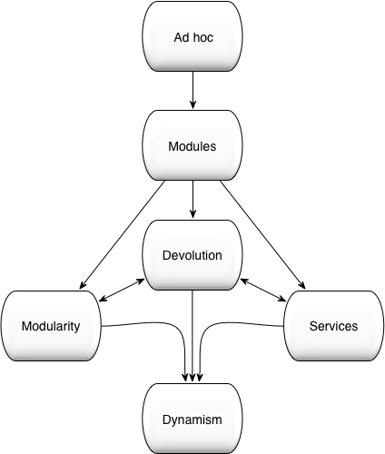

## Complexity & Cost

> The most import measure of Complexity is the cost of software maintenance: i.e. the cost required to change a System. 

A variety of studies concurr that Software maintenance can account for as much as 90% of the total life-time system cost:e.g. a study by [Erlikh 2000](Erlikh, I. (2000) Leveraging Legacy System Dollars for E-Business. Information Technology Proceedings, May/June 2000, 17-23.) determined that 80% of software costs are concerned  with **evolution** of the software.

These costs typically breakdown into following activities in the following proportions.

* Corrective (Fault Fixing) - 17%
* Adaptive (Environmental Changes) - 18%
* Perfective (New Functionality) - 61%
* Other - 4%
 
To provide a financial context, lets apply to some typical project costs:

* A small Enterprise software project that costs $1M to deliver will have a lifetime cost of $10M.
* An Industry 4.0 soluton that has an implementation costs of $20M, will have a lifetime cost of $200M.
* A modest Smart City solution that has an implementation cost of $50M, will have a lifetime cost of $500M, of which ...
    * $85M is fault fixing.
    * $90M of costs relating to changes in the Environment.
    * $305M ongoing functional enhancements.

Given the increasing sophistication of modern software solutions these figures almost certainly underestimate the total lifetime costs. 

Here we are ofcourse simply restating [DARPA's observation](090-complexity-modularity.html#the-problem).

## Possible Solutions? 

For an Organisation with **K** Systems, then change related costs per period of time can be expressed as: 

 
$$f(total cost) &#8733; \sum_{k=1}^{K}(Complexity_{k})&#215;(NumberOfChanges_{k})$$

where 

* $$Complexity_{k}$$ is the complexity of System {k}
* $$NumberOfChanges_{k}$$ are the number of changes that System {k} undergoes during the period of interest. 

Hence to minimise change costs we need to minimise this expression.

### Avoid Change

Simply avoid Change. 

Irrespective of how complex a system is, if there is no change, then no change related costs are incurred. However, real world Organisations, even those with completely static business models, must respond to security patches and component Obsolesces. 

No change strategy also results in an extremely fragile Operational environment. When the inevitable unplanned environmental change occurs (i.e. resource failure or Operational error), it is more likely to have a catastrophic effect: i.e. a Black Swan event.  

### Write Throw Away Code

Rather than trying to maintain an existing code-base, whole-sale re-write the application using commodity developer resources each time major changes are required.  

This may be a valid strategy for a small consumer start-ups, but not sophisticated Telco, Financial Service, or an Industry 4.0 solutions that require ongoing incremental enhancements to a complex inter-related eco-system of Services.

Obviously, the more modular the overall software eco-system, the simple it becomes to rip-n-replace individual Modules.
 

### Consolidate Applications

To reduce Compexity, reduces the number of Applicatons by consolidation of funtionality. However, if we consider [Glass's law](090-complexity-modularity#qualitative-measures) we can immediately see problem with this approach. 

Consider three business services each composed of 4 functions, 3 of which are the same for each System;

`System A (a,b,c,x)`, 
`System B (a,b,c,y)`, 
`System C (a,b,c,z`)
 
The Complexity estimate for these three systems would then be:

`System A (43.11) + System B (43.11) + System C (43.11) =~ 224` 

Whereas the equivalent consolidate `System D (a,b,c,x,y,z)` will have a complexity measure of `63.11 = 263` 

While Operational complexity clearly decreases, from managing 3 applications to 1 larger application, Developer Complexity (the much larger issues), remains essentially unchanged. Clearly, the degree of functional overlap between the Sysems being consolidated may be greater than 75%, or one may argue that the expotential 3.11 is too high for your organisation; however the general point concerning complexity reduction still stands. 

Also note that Operational flexibility and resilience are also reduced as the whole User population is now dependent upon the one functioning application.  

Perhaps not the desired outcome for a multi-million dollar application consolidation program. 

### Outsourcing

Here we simply sign over our Complexity problem to a 3rd party. 

The 3rd party achieves a lower cost, not by re-engineering the applications to drive down complexity, but by retaining the status-quo and using cheaper engineeing resources to implement change requests. As changes remain challenging the 3rd Party is incentivized to minimise these, and charge a premium for exceptions not covered in the contract. 

### Virtualisation, Containers and / or 3rd Party Cloud

Here we simply move the Complexity problem from a physcial platfrom to a virtual platform either on or off-site. 

Virtualisation has **no-effect** on application Complexity, and **increases** infrastructure complexity. Hence the investment in any Virtualisation or Container strategy should be justified on infrastructure costs savings through increased resource utilisation. Even then, one must account for potentially significant increases in infrastructure Complexity, which in-turn can lead to increased Service outages.

Similar arguments applies to 3rd Party Cloud providers, however they shield you from the infrastructure complexity (at a cost).

### DevOps & MicroServices?

A limited modularity strategy may be pursued via adoption of REST based Microservices. Here by 'limited' we mean that large applications are broken down into a set of smaller deployable functions that communcated with each other via REST, however the internal implementation of each Microservice remains non-Modular.

Now rather than consolidating 
	`System A (a,b,c,x)`, `System B (a,b,c,y)`, `System C (a,b,c,z)` 
we break them into the Microservices 
`µa, µb, µc, µx, µy, µz` 
which can then be re-combined into Composite Systems  
`A(µa, µb, µc, µx), B(µa, µb, µc, µy), C(µa, µb, µc, µz)` 

As already disucsssed in [Qualitative Measures](090-complexity-modularity.html#qualitative-measures), while code complexity is reduced we now have created a significant amount of Orchestration complexity: see [Complexity & Hierarchy](090-complexity-modularity.html#complexity--hierarchy).

This is a problem as Organisations lack orchestration / management platforms that are operational simple and yet capable of handling the inter-related sets of Microservices. The response is DevOps; i.e. the Development Teams are made responsible for all aspects of their Application: from code to Production Operation. However, this now results in tight coupling between the Developement teams and the Operational environment, and this introduces systemic Operational Risks. Specifically, there is always a danger that talented members of staff move on; in a DevOps centric environment that relies on high quality DevOps, this immediately translates to an Operational risk to the business: [The Wetware Crisis: the Dead Sea effect](http://brucefwebster.com/2008/04/11/the-wetware-crisis-the-dead-sea-effect/).

Note that DevOps did not originate with Netflix, neither is Microservices partuclarly new. In the mid 1990's Financial Service organisations were undergoing a technology revolution with distributed computing delivering pricing and decision support to hundreds of Traders. Application developers working side by side with Traders to deliver intra-day software releases was not uncommon. During this same period the 1st wave of Microservice architecures emerged including CORBA and the powerful Java/Jini platform.

Microservices is a qualified step in the right direction. However a ad-hoc REST based Microservices strategy lacks the Requirements / Capabilities mechanisms required to automate Orchestration & Assembly; these required to avoid exposing significant structural Complexity to the runtime. Microservices also only address one structural layer of the [runtime structural hierarchy](89-complexity-modularity.html#structural-hierarchy). 

REST based Microservices approach imposes architectural constraints on the Application which may or may not be appropriate.
{: .p.note}

We need a more coherent Modularity strategy, one that can include a Microservices approach when appropriate, but in a manner that avoids the issues identified.  

## The Modularity Maturity Model

As explained in [Agility and Modularity: Two Sides of the Same Coin](https://www.osgi.org/wp-content/uploads/AgilityandModularity2014v21.pdf), senior management are familiar with the concepts of modularity and dependencies when in the context of Organisational management structures.

Recognising this, the <em>Modularity Maturity Model</em> was proposed by Dr Graham Charters at the OSGi Community Event 2011, as a way of describing how far down the modularity path an organisation or project is. It is named after the [Capability Maturity Model](http://en.wikipedia.org/wiki/Capability_Maturity_Model), which allows organisations or projects to measure their improvements on a software development process.

Note that the following terminology is OSGi™ agnostic and that it can be applied to any modularity model. It is also intended as a guide rather than prescriptive.

### Level 1: Ad Hoc

No formal modularity exists. Dependencies are unknown. Applications have no, or limited, structure. Agile processes are likely to fail as application code bases are monolithic and highly coupled. Testing is challenging as changes propagate unchecked, causing unintentional side effects. Governance and change management are costly and acknowledged to be high-level operational risks.
 
### Level 2: Modules 

Named modules are used with explicit versioning. Dependencies are expressed in terms of module identity (including version). Maven, Ivy and RPM are examples of modularity solutions where dependencies are managed by versioned identities. Artifact repositories are used; however, their value is compromised as the artifacts are not self-describing. Agile processes are possible and do deliver some business benefit. However, the ability to realize Continuous Integration (CI) is limited by ill-defined dependencies. Governance and change management are not addressed. Testing is still failure-prone. Indeed, the testing process is now the dominant bottleneck in the agile release process. Governance and change management remain costly and continue to be high-level operational risks.

### Level 3: Modularity 

Module dependencies are now expressed via contracts (i.e. capabilities and requirements). Dependency resolution becomes the basis of software construction. Dependencies are semantically versioned, enabling the impact of change to be communicated. By enforcing strong isolation and defining dependencies in terms of capabilities and requirements, modularity enables many small development teams to efficiently work independently and in parallel. The efficiency of Scrum and Kanban management processes correspondingly increases. Sprints are now associated with one or more well-defined structural entities; i.e. the development or refactoring of OSGi bundles. Semantic versioning enables the impact of refactoring to be contained and efficiently communicated across team boundaries. Via strong modularity and isolation, parallel teams can safely sprint on different structural areas of the same application. Strong isolation and semantic versioning enable efficient/robust unit testing. Governance and change management are now demonstrably much lower operational risks.i

### Level 4: Services 

Services-based collaboration hides the construction details of services from the users of those services, so allowing clients to be decoupled from the implementations of the providers. Services lay the foundation for runtime loose coupling. The dynamic find and bind behaviors in the OSGi service model directly enable loose coupling by enabling the dynamic formation of composite applications. All local and distributed service dependencies are automatically managed. The change of perspective from code to OSGi μServices increases developer and business agility yet further: new business systems being rapidly composed from the appropriate set of pre-existing OSGi μServices.

### Level 5: Devolution

Artifact ownership is devolved to modularity-aware repositories, which encourage collaboration and enable governance. Assets may be selected on their stated capabilities. Advantages include:
 
* Greater awareness of existing modules
* Reduced duplication and increased quality
* Collaboration and empowerment
* Quality and operational control
 
As software artifacts are described in terms of a coherent set of requirements and capabilities, developers can communicate changes (breaking and non-breaking) to third parties through the use of semantic versioning. Devolution allows development teams to rapidly find third-party artifacts that meet their requirements. From a business perspective, devolution enables significant flexibility with respect to how artifacts are created, allowing distributed parties to interact in a more effective and efficient manner. Artifacts may be produced by other teams within the same organization or consumed from external third parties. The Devolution stage promotes code re-use and increases the effectiveness of offshoring/near shoring or the use of third-party, OSS or crowd-sourced software components. This, in turn, directly leads to significant and sustained reductions in operational cost.
 
### Level 6: Dynamism 

Dynamism is the culmination of the organization’s Modularity journey: this built upon Modularity, Services and Devolution.

* The Organisation is now able to automatically assembled sophisticated business Systems from modular components.
* As Application are composed from a hierarchy of self-describing components,
    * Complexity exposed to both Developers and Operations is minimised.
    * The Environment is able to dynamical assemble and maintain these self-describing Applications.
* As semantic versioning is used, the impact of change is efficiently communicated to all interested parties, including governance and change control processes.
* Individual components may be rapidly and safely deployed and /or changed in the Production environment, enabling runtimeAgilty & Adaption. 
* As the dynamic assembly process is aware of the capabilities of the hosting runtime environment, application structure and behavior may automatically adapt to location, allowing transparent deployment and optimization for public cloud or traditional private data center environments.
* Dependent upon the business problem - REST based Microservices, 12 Factor-Apps, Asychronous Actor based AI designs, or traditional XA transactional systems are all equally valid design choices.
* The Agile foundations have been layed to now effectively leverage Machine Learning & AI techniques.

Each Organization’s modularization migration strategy (i.e. the route to traverse these modularity levels) will be dictated by which characteristics are of most immediate business value to the Organisation. Most Organizations have moved from the initial Ad-Hoc phase to Modules. Services, in the guise of 'Microservices' is currenly popular, however few Organisations have implemented true Modularity or Devolution. Organizations that value a high degree of Agility and / or Adaptive Automation will wish to reach the Dynamism endpoint as soon as possible.

## Conclusions 

Complexity is a Critical business problem. Complexity cannot be ignored, cannot be consolidated away, hidden by a third Party Cloud or an out-source contract. Directly or indirectly the costs associated with Complexity will always re-emerge. An effective Modularity strategy is **the essential** strategy for addressing Complexity and delivering high maintainable, economically sustainable software systems.

While Microservices nominally provide a language agnostic approach to delivering course grained Modules and Services, this lowest common demoninator approach fails in several important aspects. In contrast, as we'll now see, OSGi™ delivers a coherent modularity strategy; which as demonstrate by the [enRoute Microservices tutorial](/tutorial/030-tutorial_microservice) includes, but is not constrained to being only, Microservices.

But this constrains us to Java? 

The [TIOBE Index for January 2018](https://www.tiobe.com/tiobe-index/) yet again places Java as the industries leading programming language, a position broadly held since 2003. Also the wisdom of the Polyglot languge approach championed by Microservices needs to be challenged; as this introduces a needless level of language diversity (unnecessary Complexity) into an Organistion: see [CISQ Technical Debt Calculation](ihttp://it-cisq.org/standards/technical-debt/).

Most importantly for future software eco-systems, OSGi™/Java is the only modularity / language combination powerful enought to address todays Complexity Crisis and so DARPA's longevity challenge. That said, the OSGi Alliance are looking to generalise OSGi Dependency Management and Service Registry concepts, bringing these benefits to other popular languages.  

> “First they ignore you, then they ridicule you, then they fight you, then you win.”
-- Mahatma Gandhi

> OSGi is a disruptive technology that will transform how enterprise Java applications are designed, developed, and managed!

