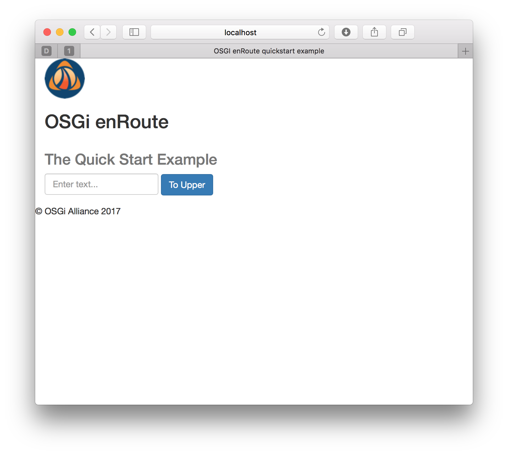

## Summary 

A simple tutorial where we first run, and then re-create and re-run, a simple OSGi™ Microservice.

## Running the Application

We start by first downloading, building and running the enRoute `quickstart` example. In addition to demonstrating the simple application, this will also confirm that your local [environment](015-Prerequisite.html#required-tools) meets the require prerequisits.

Download the [enroute examples](https://github.com/timothyjward/osgi.enroute/tree/55e14b52e277c653ad8975eccf7e92d7813abfec) from GitHub and change directory into `examples/quickstart`.
 
Build the Application with the following commands:


$ mvn install
$ mvn bnd-resolver:resolve
$ mvn package 


We now have a runnable artefact which can be started with the command 

$ java -jar app/target/app.jar


To test that the application is running visit the [quickstart](http://localhost:8080/quickstart/index.html) application URL for a friendly greeting,

{: height="400px" width="400px"}

or if minimalisim is more your thing, the raw REST endpoint [http://localhost:8080/rest/upper/lower](http://localhost:8080/rest/upper/lower).

When you want to terminate the application press **Ctrl+C**.

## Project Setup

We'll now recreate the quickstart example locally as though it were your own greenfield OSGi project. 

It is assumed that you have the required [environment](015-Prerequisite.html#required-tools) installed on your laptop and created the [setting.xml](017-enRoute-ArcheTypes.html#project-setup-for-snapshot-archetypes) project skeleton in your project root directory. 
{: .note }

First issue the command to create the project template

    mvn -s settings.xml archetype:generate -DarchetypeGroupId=org.osgi.enroute.archetype -DarchetypeArtifactId=project -DarchetypeVersion=7.0.0-SNAPSHOT

Fillng the the project details with appropriate values 

    Define value for property 'groupId': com.acme.example
    Define value for property 'artifactId': quickstart
    Define value for property 'version' 1.0-SNAPSHOT: : 
    Define value for property 'package' com.acme.example: : 
    Confirm properties configuration:
    groupId: com.acme.example
    artifactId: quickstart
    version: 1.0-SNAPSHOT
    package: com.acme.example
    Y: : 

## Creating an OSGi™ MicroService using the CLI

Having created the project skeleton, replace the contents of `quickstart/impl/src/main/java/com/acme/example/ComponentImpl.java` 


package com.paremus.examples;

    import org.osgi.service.component.annotations.Component;

    @Component
    public class ComponentImpl {
    
        //TODO add an implementation
    
    }


with the following code,


package com.acme.prime.upper.application;
 
import javax.ws.rs.GET;
import javax.ws.rs.Path;
import javax.ws.rs.PathParam;
 
import org.osgi.service.component.annotations.Component;
import org.osgi.service.jaxrs.whiteboard.propertytypes.JaxrsResource;
 
@Component(service=ComponentImpl.class)
@JaxrsResource
public class ComponentImpl {
     
    @Path("rest/upper/{string}")
    @GET
    public String toUpper(@PathParam("string") String string) {
        return string.toUpperCase();
    }
     
}

and then save the file.

As shown, the modifications include:
* An implementation replacing the the `TODO` section
* As this is a MicroService the `@JaxrsResource` annotation is included.
* The `@Component` is modified to `@Component(service=ComponentImpl.class)`
* The required `imports` are included. 

From your `quickstart` project root we now build the example.

$ mvn install

If this step fails, run the following `mvn bnd-resolver:resolve` and then repeate `mvn install`
{: .warning}

Before generating the runtime dependency information used by the OSGi framework take a look at `quickstart\app\app.bndrun`

    index: target/index.xml

    -standalone: ${index}

    -runrequires: osgi.identity;filter:='(osgi.identity=com.acme.example.impl)'
    -runfw: org.apache.felix.framework
    -runee: JavaSE-1.8

As shown no `runbundles` are currently specified. We specify the `runbundles` with


$ mvn bnd-resolver:resolve

And now we see that our application `com.acme.example.impl` and the OSGi Declarative Services framework have been included.

    index: target/index.xml

    -standalone: ${index}

    -runrequires: osgi.identity;filter:='(osgi.identity=com.acme.example.impl)'
    -runfw: org.apache.felix.framework
    -runee: JavaSE-1.8
    -runbundles: \
            com.acme.example.impl;version='[1.0.0,1.0.1)',\
            org.apache.felix.scr;version='[2.1.0,2.1.1)'

We now create a runnable application JAR as follows

$ mvn package


and the resultant `quickstart` application may be started as described [above](020-tutorial_qs.html#running-the-application) 

## Creating an OSGi™ MicroService using Eclipse IDE

We'll now repeate this process using the Eclipse IDE. Make sure that you've followed the [project setup](020-tutorial_qs.html#project-setup) instructions, that your version of [Eclipse](015-Prerequisite.html#useful-tools) meets the require prerequisits, and that you have the appropriate version of the [bndtools](015-Prerequisite.html#installing-bndtools) plugin installed.

Launch eclipse and **import** the Maven project just created in `quickstart` directory. 

**Menu File -> Import**

{: height="400px" width="400px"} 

Click **Next** and browse for the directory created with the name `quickstart`.

{: height="400px" width="400px"}
 
Now open the **Bndtools** perspective clicking the open perspective toolbar in the top left corner.

{: height="400px" width="400px"}

The Maven project template has created a root maven project called `quickstart` and two maven modules:

* `impl`-  for the implementation of the bundle 
* `app` - used to package the app.

The next step is to write the implementation code in the provided component class. 

On open the `ComponentImpl` source file you'll see the following tesmplate 


    package com.paremus.examples;

    import org.osgi.service.component.annotations.Component;

    @Component
    public class ComponentImpl {
    
        //TODO add an implementation
    
    }


This needs to be edit to include:

* An implementation replacing the the **TODO** section 
* As this is a MicroService include the `@JaxrsResource` annotation
* Modify `@Component` to `@Component(service=ComponentImpl.class)`
* Incude the required `imports`

After which the `CompenentImpl` will look as follows:


    package com.acme.prime.upper.application;

    import javax.ws.rs.GET;
    import javax.ws.rs.Path;
    import javax.ws.rs.PathParam;

    import org.osgi.service.component.annotations.Component;
    import org.osgi.service.jaxrs.whiteboard.propertytypes.JaxrsResource;

    @Component(service=ComponentImpl.class)
    @JaxrsResource
    public class ComponentImpl {
    
        @Path("rest/upper/{string}")
        @GET
        public String toUpper(@PathParam("string") String string) {
            return string.toUpperCase();
        } 
    
    }


Now remember to **Save** your changes.

## Running the MicroService

Now it's time to run the bundle and see if it works. 

In the `app` maven module, double click `app.bndrun` to display `Bndtools Resolve` screen. Here we can see that the implementation bundle is added to the run requirements.

We need to resolve all the dependencies to run the bundle and see our message displayed so 

Click the **Resolve** button...
{: height="400px" width="400px"}

Now click **Finish** button...
{: height="400px" width="400px"}

It's ready to run. Select the **Run OSGi** button

See the results in the console screen.

With the project running, navigate to [http://localhost:8080/rest/upper/lower](http://localhost:8080/rest/upper/lower) and see check the results

We confirmed that the service is working as expected. 

## Creating a runnable artefact

The last step is to generate a runnable jar file. 
Right click the `quickstart` module in the left pane, and select **Run As -> Maven**

Enter package as the goal and click **Run**
{: height="400px" width="400px"}

Wait for maven to finish the generation.

The runnable jar file created will be `app/target/app.jar`. 

To run the service using the following command in the console:

    java -jar app/target/app.jar

To test the service visit the REST endpoint URL [http://localhost:8080/rest/upper/lower](http://localhost:8080/rest/upper/lower)

When you want to exit press **Ctrl+C**.

    [INFO] Started Jetty 9.3.22.v20171030 at port(s) HTTP:8080 on context path / [minThreads=8,maxThreads=200,acceptors=1,selectors=4]
    Jan 09, 2018 9:16:57 PM org.apache.cxf.endpoint.ServerImpl initDestination
    INFO: Setting the server's publish address to be /
    [DEBUG] [ServiceReference 14 from bundle 7 : org.apache.aries.jax.rs.whiteboard:0.0.1.201712130150 ref=[org.osgi.service.http.context.ServletContextHelper] properties={objectClass=[org.osgi.service.http.context.ServletContextHelper], osgi.http.whiteboard.context.name=default, osgi.http.whiteboard.context.path=, service.bundleid=7, service.id=14, service.scope=singleton}] Ignoring invalid ServletContextHelper service
    21:16:57.494 [main] DEBUG org.eclipse.jetty.util.component.ContainerLifeCycle - org.eclipse.jetty.server.Server@7586beff added {org.apache.felix.http.jetty.internal.RequestLogTracker@2d9caaeb,POJO}
    Jan 09, 2018 9:16:57 PM org.apache.cxf.endpoint.ServerImpl initDestination
    INFO: Setting the server's publish address to be /

