## Summary 

Simplest project to get a running osgi app in fewer steps

## Project Setup

Paste the following Maven project skeletion to a file named `settings.xml`.

    <settings>
      <profiles>
        <profile>
          <id>OSGi</id>
          <activation>
            <activeByDefault>true</activeByDefault>
          </activation>
          <repositories>
            <repository>
              <id>osgi-archetype</id>
              <url>https://oss.sonatype.org/content/groups/osgi</url>
              <releases>
                <enabled>true</enabled>
                <checksumPolicy>fail</checksumPolicy>
              </releases>
              <snapshots>
                <enabled>true</enabled>
                <checksumPolicy>warn</checksumPolicy>
              </snapshots>
            </repository>
          </repositories>
        </profile>
      </profiles>
    </settings>

Now issue the command

    mvn -s settings.xml archetype:generate -DarchetypeGroupId=org.osgi.enroute.archetype -DarchetypeArtifactId=project -DarchetypeVersion=7.0.0-SNAPSHOT

Fill in the settings as shown

    Define value for property 'groupId': com.acme.example
    Define value for property 'artifactId': quickstart
    Define value for property 'version' 1.0-SNAPSHOT: : 
    Define value for property 'package' com.acme.example: : 
    Confirm properties configuration:
    groupId: com.acme.example
    artifactId: quickstart
    version: 1.0-SNAPSHOT
    package: com.acme.example
    Y: : 

## Creating an OSGi™ MicroService

Launch eclipse and **import** the Maven project that was created in `quickstart` directory. 

**Menu File -> Import**

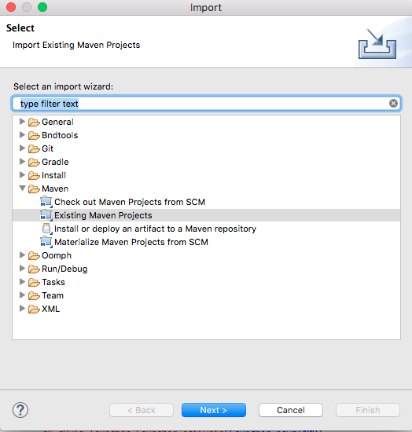{: height="400px" width="400px"} 

Click **Next** and browse for the directory created with the name `quickstart`.

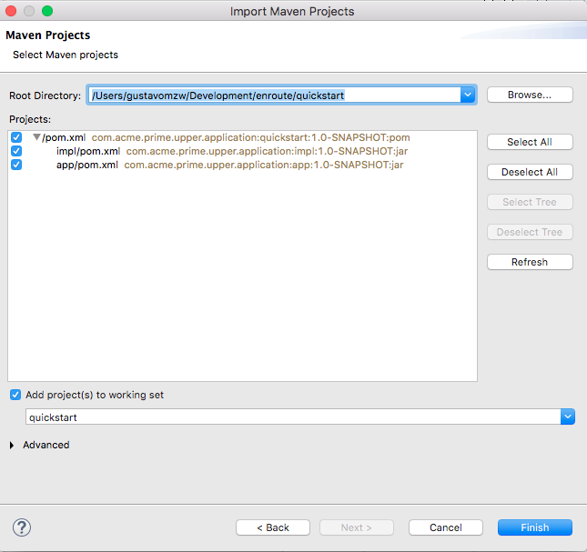{: height="400px" width="400px"}
 
Now open the **Bndtools** perspective clicking the open perspective toolbar in the top left corner.

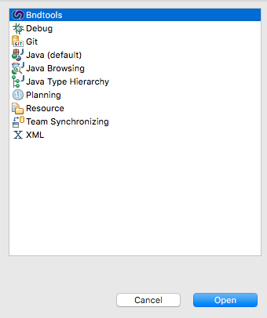{: height="400px" width="400px"}

The Maven project template has created a root maven project called `quickstart` and two maven modules:

* `impl`-  for the implementation of the bundle 
* `app` - used to package the app.

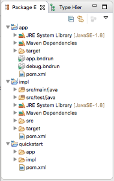

The next step is to write the implementation code in the provided component class. 

On open the `ComponentImpl` source file you'll see the following tesmplate 

    package com.paremus.examples;

    import org.osgi.service.component.annotations.Component;

    @Component
    public class ComponentImpl {
    
        //TODO add an implementation
    
    }

This needs to be edit to include:

* An implementation replacing the the **TODO** section 
* As this is a MicroService include the `@JaxrsResource` annotation
* Modify `@Component` to `@Component(service=ComponentImpl.class)`
* Incude the required `imports`

After which the `CompenentImpl` will look as follows:

    package com.acme.prime.upper.application;

    import javax.ws.rs.GET;
    import javax.ws.rs.Path;
    import javax.ws.rs.PathParam;

    import org.osgi.service.component.annotations.Component;
    import org.osgi.service.jaxrs.whiteboard.propertytypes.JaxrsResource;

    @Component(service=ComponentImpl.class)
    @JaxrsResource
    public class ComponentImpl {
    
        @Path("rest/upper/{string}")
        @GET
        public String toUpper(@PathParam("string") String string) {
            return string.toUpperCase();
        } 
    
    }

Now remember to **Save** your changes.

## Running the MicroService

Now it's time to run the bundle and see if it works. 

In the `app` maven module, double click `app.bndrun` to display `Bndtools Resolve` screen. Here we can see that the implementation bundle is added to the run requirements.

We need to resolve all the dependencies to run the bundle and see our message displayed so 

Click the **Resolve** button...
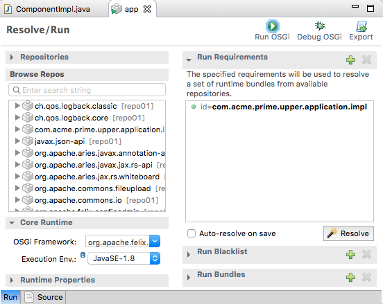{: height="400px" width="400px"}

Now click **Finish** button...
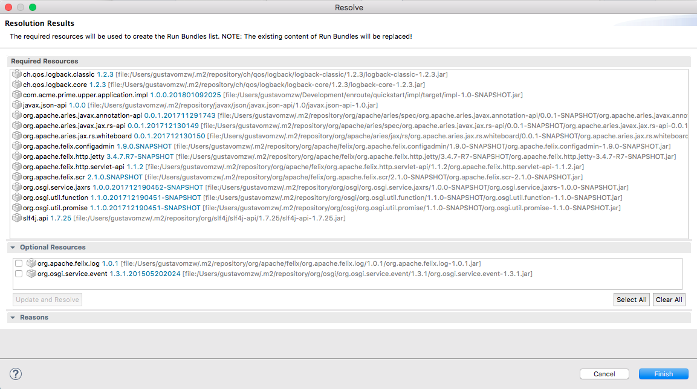{: height="400px" width="400px"}

It's ready to run. Select the **Run OSGi** button
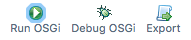

See the results in the console screen.
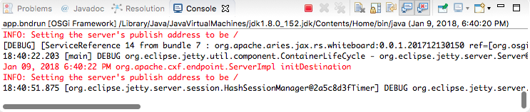

With the project running, navigate to [http://localhost:8080/rest/upper/lower](http://localhost:8080/rest/upper/lower) and see check the results
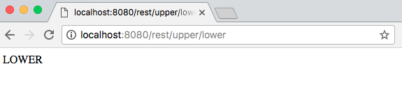

We confirmed that the service is working as expected. 

## Creating a runnable artefact

The last step is to generate a runnable jar file. 
Right click the `quickstart` module in the left pane, and select **Run As -> Maven**
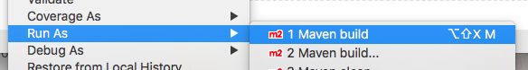

Enter package as the goal and click **Run**
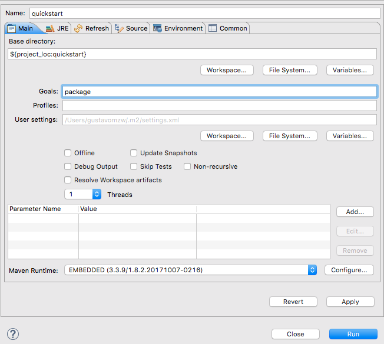{: height="400px" width="400px"}

Wait for maven to finish the generation.
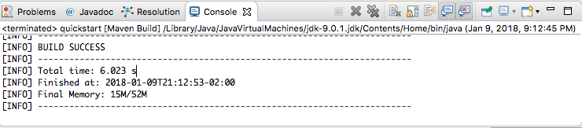

The runnable jar file created will be `app/target/app.jar`. To run the service using the following command in the console:

    java -jar app/target/app.jar

To Test the service using the browser visit the previous URL [http://localhost:8080/rest/upper/lower](http://localhost:8080/rest/upper/lower)

When you want to exit press **Ctrl+C**.

    [INFO] Started Jetty 9.3.22.v20171030 at port(s) HTTP:8080 on context path / [minThreads=8,maxThreads=200,acceptors=1,selectors=4]
    Jan 09, 2018 9:16:57 PM org.apache.cxf.endpoint.ServerImpl initDestination
    INFO: Setting the server's publish address to be /
    [DEBUG] [ServiceReference 14 from bundle 7 : org.apache.aries.jax.rs.whiteboard:0.0.1.201712130150 ref=[org.osgi.service.http.context.ServletContextHelper] properties={objectClass=[org.osgi.service.http.context.ServletContextHelper], osgi.http.whiteboard.context.name=default, osgi.http.whiteboard.context.path=, service.bundleid=7, service.id=14, service.scope=singleton}] Ignoring invalid ServletContextHelper service
    21:16:57.494 [main] DEBUG org.eclipse.jetty.util.component.ContainerLifeCycle - org.eclipse.jetty.server.Server@7586beff added {org.apache.felix.http.jetty.internal.RequestLogTracker@2d9caaeb,POJO}
    Jan 09, 2018 9:16:57 PM org.apache.cxf.endpoint.ServerImpl initDestination
    INFO: Setting the server's publish address to be /

