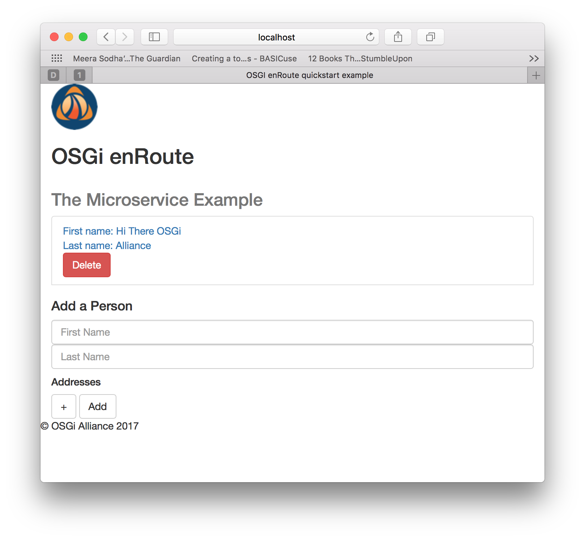

This tutorial is Maven and command-line based; the reader may follow this verbatim or use their favorite Java/IDE.

## Introduction

This Tutorial walks through the creation of REST microservice comprised of the following structural elements:
* An API module
* A DAO Implementation module
* A Rest Service Implementation module 
* The Composite Application module

each of these _Implementation_ and _Composite Application_ Modules having a corresponding Index POM: i.e. a [dedicated curated repository](../FAQ/200-resolving.html#managing-repositories).  

We start by creating the required project skeleton.

## Creating the Project

Using the [bare-project Archetype](017-enRoute-ArcheTypes.html#the-project-archetype), in your project root directory (i.e. the directory containing your [`settings.xml` configuration](017-enRoute-ArcheTypes.html#project-setup-for-snapshot-archetypes)), create the **microservice** project:


$ mvn -s settings.xml archetype:generate -DarchetypeGroupId=org.osgi.enroute.archetype -DarchetypeArtifactId=project-bare -DarchetypeVersion=7.0.0-SNAPSHOT


with the following values:

    Define value for property 'groupId': org.osgi.enroute.examples
    Define value for property 'artifactId': microservice
    Define value for property 'version' 1.0-SNAPSHOT: : 0.0.1-SNAPSHOT
    Define value for property 'package' org.osgi.enroute.examples: :
    Confirm properties configuration:
    groupId: org.osgi.enroute.examples
    artifactId: microservice
    version: 0.0.1-SNAPSHOT
    package: org.osgi.enroute.examples
    Y: :

**Note** - if you use alternative `groupId`, `artifactId` values remember to update the `packageinfo` and `import` statements in the files used throughout the rest of this tutorial.
{: .note }

We now create the required modules. 

## The DAO API 

Change directory into the newly created `microservice` project directory; then create the `api` module using the [api Archetype](017-enRoute-ArcheTypes.html#the-api-archetype) as shown:


$ mvn -s ../settings.xml archetype:generate -DarchetypeGroupId=org.osgi.enroute.archetype -DarchetypeArtifactId=api -DarchetypeVersion=7.0.0-SNAPSHOT


with the following values:

    Define value for property 'groupId': org.osgi.enroute.examples.microservice
    Define value for property 'artifactId': dao-api
    Define value for property 'version' 1.0-SNAPSHOT: : 0.0.1-SNAPSHOT
    Define value for property 'package' org.osgi.enroute.examples.microservice: :org.osgi.enroute.examples.microservice.dao
    Confirm properties configuration:
    groupId: org.osgi.enroute.examples.microservice
    artifactId: dao-api
    version: 0.0.1-SNAPSHOT
    package: org.osgi.enroute.examples.microservice.dao 
    Y: :

Now create the following two files:

`dao-api/src/main/java/org/osgi/enroute/examples/microservice/dao/PersonDao.java`

  <a class="btn btn-primary" data-toggle="collapse" href="#PersonDao" aria-expanded="false" aria-controls="PersonDao">
    PersonDAO.java 
  </a>

  





`dao-api/src/main/java/org/osgi/enroute/examples/microservice/dao/AddressDao.java`

  <a class="btn btn-primary" data-toggle="collapse" href="#AddressDao" aria-expanded="false" aria-controls="AddressDao">
    AddressDAO.java 
  </a>

  





### Dependencies

`dao-api` has no dependencies.

### Visibility
`dao-api` is an API package that is shared between bundles: e.g. `RestComponentImpl`, `PersonDaoImpl` & `AddressDaoImpl` all import `dao-api`. This sharing information is conveyed by the file `dao-api/src/main/java/org/osgi/enroute/examples/microservice/dao/package-info.java` which was automatically generated for you: 

  <a class="btn btn-primary" data-toggle="collapse" href="#package-info-dao" aria-expanded="false" aria-controls="package-info-dao">
    package-info.java
  </a>

  





  

For more information on `package-info.java` see [Semantic Versioning](../FAQ/210-semantic_versioning.html).

### Defining the DTO 

Data transfer between the components is achieved via the use of [Data Transfer Objects (DTO's)](../FAQ/420--dtos.html).

To achieve this create the directory `dao-api/src/main/java/org/osgi/enroute/examples/microservice/dao/dto` into which we place the following three files:

`dao-api/src/main/java/org/osgi/enroute/examples/microservice/dao/dto/package-info.java`

  <a class="btn btn-primary" data-toggle="collapse" href="#package-info-dto" aria-expanded="false" aria-controls="package-info-dto">
    package-info.java
  </a>

  





`dao-api/src/main/java/org/osgi/enroute/examples/microservice/dao/dto/PersonDTO.java`

  <a class="btn btn-primary" data-toggle="collapse" href="#PersonDTO" aria-expanded="false" aria-controls="PersonDTO">
    PersonDTO.java 
  </a>

  





`dao-api/src/main/java/org/osgi/enroute/examples/microservice/dao/dto/AddressDTO.java`

  <a class="btn btn-primary" data-toggle="collapse" href="#AddressDTO" aria-expanded="false" aria-controls="AddressDTO">
   AddressDTO.java 
  </a>

  



 

## The DAO implementation 

In the `microservice` project director now create the `impl` module using the [ds-component Archetype](017-enRoute-ArcheTypes.html#the-ds-component-archetype):


$ mvn -s ../settings.xml archetype:generate -DarchetypeGroupId=org.osgi.enroute.archetype -DarchetypeArtifactId=ds-component -DarchetypeVersion=7.0.0-SNAPSHOT


with the following values:

    Define value for property 'groupId': org.osgi.enroute.examples.microservice
    Define value for property 'artifactId': dao-impl
    Define value for property 'version' 1.0-SNAPSHOT: : 0.0.1-SNAPSHOT
    Define value for property 'package' org.osgi.enroute.examples.microservice: : org.osgi.enroute.examples.microservice.dao.impl
    Confirm properties configuration:
    groupId: org.osgi.enroute.examples.microservice
    artifactId: dao-impl
    version: 0.0.1-SNAPSHOT
    package: org.osgi.enroute.examples.microservice.dao.impl
    Y: :

Place the following four files into the directory `dao-impl/src/main/java/org/osgi/enroute/examples/microservice/dao/impl`:

`dao-impl/src/main/java/org/osgi/enroute/examples/microservice/dao/impl/PersonTable.java`

  <a class="btn btn-primary" data-toggle="collapse" href="#PersonTable" aria-expanded="false" aria-controls="PersonTable">
    PersonTable.java 
  </a>

  





`dao-impl/src/main/java/org/osgi/enroute/examples/microservice/dao/impl/PersonDaoImpl.java`

  <a class="btn btn-primary" data-toggle="collapse" href="#PersonDaoImpl" aria-expanded="false" aria-controls="PersonDaoImpl">
    PersonDaoImpl.java 
  </a>

  





`dao-impl/src/main/java/org/osgi/enroute/examples/microservice/dao/impl/AddressTable.java`

  <a class="btn btn-primary" data-toggle="collapse" href="#AddressTable" aria-expanded="false" aria-controls="AddressTable">
    AddressTable.java 
  </a>

  





`dao-impl/src/main/java/org/osgi/enroute/examples/microservice/dao/impl/AddressDaoImpl.java`

  <a class="btn btn-primary" data-toggle="collapse" href="#AddressDaoImpl" aria-expanded="false" aria-controls="AddressDaoImpl">
    AddressDaoImpl.java 
  </a>

  





### Dependencies

The `dao-impl` has a dependency on `dao-api`. Also `PersonalDaoImpl.java` and `AddressDaoImpl.java` implementations (see below) have dependencies on the `slf4j` logging API. This dependency information is added to the `<dependencies>` section of `dao-impl/pom.xml`: i.e. `dao-impl`'s [repository](../FAQ/200-resolving.html#managing-repositories).


<dependency>
    <groupId>org.osgi.enroute.examples.microservice</groupId>
    <artifactId>dao-api</artifactId>
    <version>0.0.1-SNAPSHOT</version>
</dependency>
<dependency>
    <groupId>org.slf4j</groupId>
    <artifactId>slf4j-api</artifactId>
    <version>1.7.25</version>
</dependency>


### Visibility

Implmentations should **NOT** be shared; hence no `package-info.java` file.
{: .note } 

## The REST Service

In the `microservice` project director now create the `rest-component` module using the [rest-component Archetype](017-enRoute-ArcheTypes.html#the-rest-component-archetype):


$ mvn -s ../settings.xml archetype:generate -DarchetypeGroupId=org.osgi.enroute.archetype -DarchetypeArtifactId=rest-component -DarchetypeVersion=7.0.0-SNAPSHOT


with the following values:

    Define value for property 'groupId': org.osgi.enroute.examples.microservice
    Define value for property 'artifactId': rest-service
    Define value for property 'version' 1.0-SNAPSHOT: : 0.0.1-SNAPSHOT
    Define value for property 'package' org.osgi.enroute.examples.microservice: : org.osgi.enroute.examples.microservice.rest
    Confirm properties configuration:
    groupId: org.osgi.enroute.examples.microservice
    artifactId: rest-service
    version: 0.0.1-SNAPSHOT
    package: org.osgi.enroute.examples.microservice.rest
    Y: :

Copy the following two files into the directory `rest-service/src/main/java/org/osgi/enroute/examples/microservice/rest`: 

`rest-service/src/main/java/org/osgi/enroute/examples/microservice/rest/RestComponentImpl.java`

  <a class="btn btn-primary" data-toggle="collapse" href="#RestComponentImpl" aria-expanded="false" aria-controls="RestComponentImpl">
    RestComponentImpl.java 
  </a>

  





`rest-service/src/main/java/org/osgi/enroute/examples/microservice/rest/JsonpConvertingPlugin.java`

  <a class="btn btn-primary" data-toggle="collapse" href="#JsonpConvertingPlugin" aria-expanded="false" aria-controls="JsonpConvertingPlugin">
   JsonpConvertingPlugin.java 
  </a>

  





We now create the directory `rest-service/src/main/resources/static/main/html` in which we create the following file:

`rest-service/src/main/resources/static/main/html/person.html`

  <a class="btn btn-primary" data-toggle="collapse" href="#person" aria-expanded="false" aria-controls="person">
    person.html
  </a>

  



  

And we create the `rest-service/src/main/resources/static/css` directory for the `style.css` file

`rest-service/src/main/resources/static/css/style.css`

  <a class="btn btn-primary" data-toggle="collapse" href="#style" aria-expanded="false" aria-controls="style">
   style.css 
  </a>

  





In directory `rest-service/src/main/resources/static` add the following `index.html`

`rest-service/src/main/resources/static/index.html`

  <a class="btn btn-primary" data-toggle="collapse" href="#index" aria-expanded="false" aria-controls="index">
    index.html 
  </a>

  





Finally create the directory `rest-service/src/main/resources/static/main/img` into which save the following icon with the name `enroute-logo-64.png`

 

### Dependencies

As the `rest-service` module has dependencies on the `dao-api` and `json-api` these dependencies are added to the `<dependencies>` section in `rest-service/pom.xml`. A `JAX-RS` implementation dependency is also included so that the `rest-service` can be unit tested. 


<dependency>
    <groupId>org.apache.servicemix.specs</groupId>
    <artifactId>org.apache.servicemix.specs.json-api-1.1</artifactId>
    <version>2.9.0</version>
</dependency>
<dependency>
    <groupId>org.osgi.enroute.examples.microservice</groupId>
    <artifactId>dao-api</artifactId>
    <version>0.0.1-SNAPSHOT</version>
</dependency>
<dependency>
    <groupId>org.apache.johnzon</groupId>
    <artifactId>johnzon-core</artifactId>
    <version>1.1.0</version>
</dependency>


### Visibility

Implmentations should **NOT** be shared; hence no `package-info.java` file.
{: .note }

## The Composite Application 

We now pull these Modules together to create the Composite Application.
 
In the `microservice` project directory create the `application` module using the [application Archetype](017-enRoute-ArcheTypes.html#the-application-archetype):


$ mvn -s ../settings.xml archetype:generate -DarchetypeGroupId=org.osgi.enroute.archetype -DarchetypeArtifactId=application -DarchetypeVersion=7.0.0-SNAPSHOT


with the following values:

    Define value for property 'groupId': org.osgi.enroute.examples.microservice
    Define value for property 'artifactId': rest-app
    Define value for property 'version' 1.0-SNAPSHOT: : 0.0.1-SNAPSHOT
    Define value for property 'package' org.osgi.enroute.examples.microservice: :
    Define value for property 'impl-artifactId': dao-impl
    Define value for property 'impl-groupId' org.osgi.enroute.examples.microservice: :
    Define value for property 'impl-version' 0.0.1-SNAPSHOT: :
    Confirm properties configuration:
    groupId: org.osgi.enroute.examples.microservice
    artifactId: rest-app
    version: 0.0.1-SNAPSHOT
    package: org.osgi.enroute.examples.microservice
    impl-artifactId: dao-impl
    impl-groupId: org.osgi.enroute.examples.microservice
    impl-version: 0.0.1-SNAPSHOT
    Y: :

### Dependencies
Add the following dependencies inside `<dependencies>` section of the file `rest-app/pom.xml`


<dependency>
    <groupId>org.osgi.enroute</groupId>
    <artifactId>osgi-api</artifactId>
    <type>pom</type>
</dependency>
<dependency>
    <groupId>org.osgi.enroute.examples.microservice</groupId>
    <artifactId>rest-service</artifactId>
    <version>0.0.1-SNAPSHOT</version>
</dependency>
<dependency>
    <groupId>org.apache.johnzon</groupId>
    <artifactId>johnzon-core</artifactId>
    <version>1.1.0</version>
</dependency>
<dependency>
    <groupId>com.h2database</groupId>
    <artifactId>h2</artifactId>
    <version>1.4.196</version>
    <scope>runtime</scope>
</dependency>


### Define Runtime Entity
Overwrite the contents of `rest-app/rest-app.bndrun` with:

`rest-app/rest-app.bndrun`

index: target/index.xml

-standalone: ${index}

-resolve.effective: active

-runrequires: \
    osgi.identity;filter:='(osgi.identity=org.osgi.enroute.examples.microservice.rest-service)',\
    osgi.identity;filter:='(osgi.identity=org.apache.johnzon.core)',\
    osgi.identity;filter:='(osgi.identity=org.h2)',\
    bnd.identity;version='0.0.1.201801031655';id='org.osgi.enroute.examples.microservice.rest-app'
-runfw: org.apache.felix.framework
-runee: JavaSE-1.8


Add the following plugin inside `<plugins>` section in the file `rest-app/pom.xml`


<plugin>
    <groupId>biz.aQute.bnd</groupId>
    <artifactId>bnd-maven-plugin</artifactId>
</plugin>


### Runtime Configuration

In the directory `rest-app/src/main/java/config` check that `package-info` is as follows: 

`rest-app/src/main/java/config/package-info.java`

  <a class="btn btn-primary" data-toggle="collapse" href="#package-info-config" aria-expanded="false" aria-controls="package-info-config">
    package-info.java
  </a>

  





Also overwrite the contents of `rest-app/src/main/resources/OSGI-INF/configurator/configuration.json` with the following:

 

  <a class="btn btn-primary" data-toggle="collapse" href="#configuration" aria-expanded="false" aria-controls="configuration">
    configuration.json
  </a>

  





## Build & Run

Build the modules and install in local maven repository from the top level project directory

    mvn install

**Note** - if `rest-app` fails, run the following resolve command and then re-run `mvn install` 
{: .note }

We now Generate OSGi™ index with the project dependencies from the top level project directory

    mvn bnd-resolver:resolve

And generate the runnable jar from the top level project directory

    mvn package

To run the resultant OSGi based REST Microservice change back to the top level project directory and run

    java -jar rest-app/target/rest-app.jar

The REST service can be seen by pointing a browser to [http://localhost:8080/microservice/index.html](http://localhost:8080/microservice/index.html)

{: height="450px" width="450px"}

Stop the application using Ctrl+C in the console.

